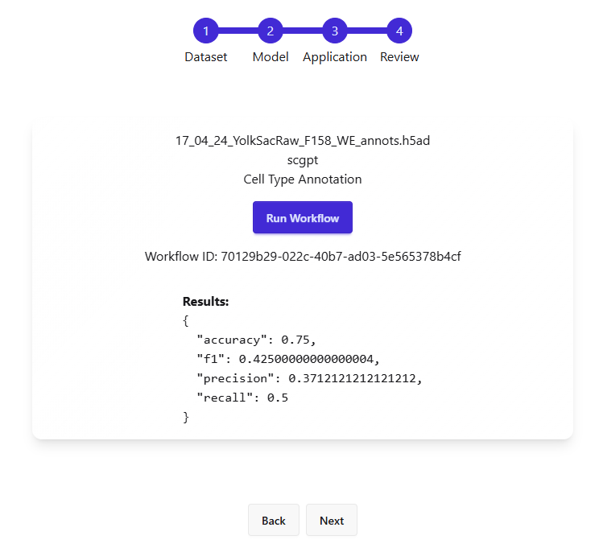

# Helical-AI Workflow Web Application

A modern web application for single-cell genomics analysis, featuring automated cell type annotation using state-of-the-art machine learning models.

---

## User Guide

### 1. Select Dataset

Begin by choosing or uploading your single-cell dataset. Supported formats include `.h5ad`, `.csv`, and `.xlsx`.

Use https://huggingface.co/datasets/helical-ai/yolksac_human


---

### 2. Choose Model

Select a pre-trained model. Here we have used scgpt


---

### 3. Select Application

Pick the application, for example we will use such as Cell Type Annotation.


---

### 4. Review Workflow

This section allows you to review your workflow, and will only run when all three (dataset, model, and applcation) are chosen 


---

### 5. Running Analysis

Once you run the workflow, it will begin, running. For demo sake the epoch and sample size has been reduced.


---

### 6. View Results

After completion, view and export your results. The results page provides visualisations and summary statistics.



---

## Quick Start

1. **Clone the repository**
   ```bash
   git clone https://github.com/jamesthapamagar/helical-ai.git
   cd helical-ai
   ```
2. **Prepare your dataset**
   - Create a `dataset` folder in the project root
   - Download your dataset and place it in the `dataset` folder
   - yolksac_human is recommened, however cannot be included in the repo due to size issues
3. **Build and run the application**

   ```bash
   docker compose up --build
   ```
4. **Access the web interface**
   - Open your browser and go to [http://localhost:5173](http://localhost:5173)
